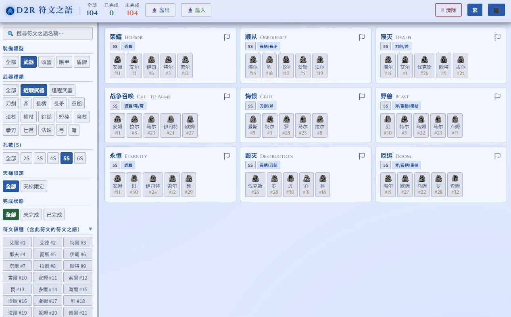
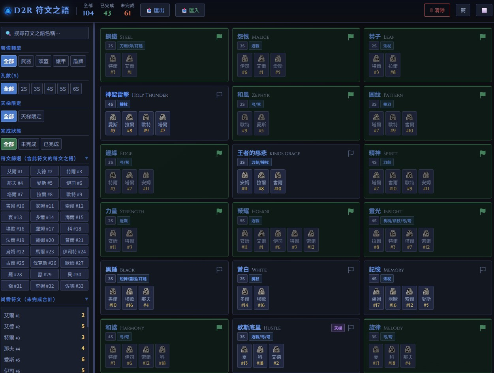
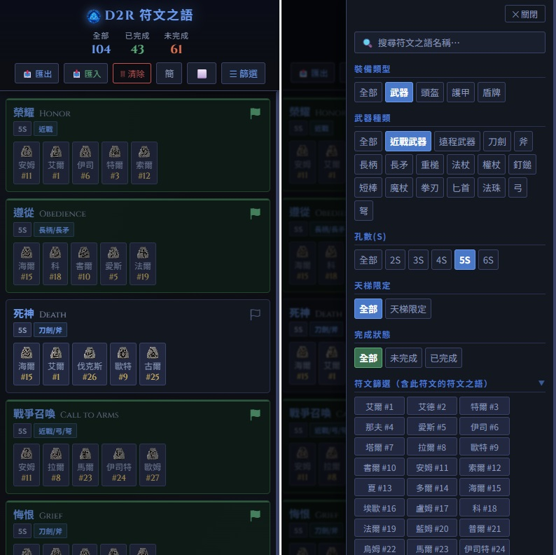

# D2R 符文之語收集筆記 / D2R Runeword Collection Notes

> 一個輕量的《暗黑破壞神 II：復活》符文之語追蹤工具，支援手機、支援繁簡切換、支援黑白主題。

🌐 **線上體驗**
- [Cloudflare Workers](https://d2r-runeword-collection-notes.awdrrawd39.workers.dev/)
- [GitHub Pages](https://awdrrawd.github.io/d2r-runeword-collection-notes/)

---

## ✨ 功能特色

| 功能 | 說明 |
|------|------|
| ✅ 完成標記 | 點擊旗幟圖示，記錄已收集的符文之語 |
| 💾 匯出進度 | 將進度匯出為 `.txt` 文字檔（內嵌 JSON 備份資料） |
| 📥 匯入進度 | 從 `.txt` 檔案還原進度 |
| 🔍 多條件篩選 | 依裝備類型、武器種類、孔數、天梯限定、完成狀態篩選 |
| 💎 符文篩選 | 點選任意符文，顯示所有含該符文的符文之語 |
| 🔮 尚需符文統計 | 自動統計未完成項目中各符文的需求數量 |
| 📱 手機模式 | 響應式佈局，手機瀏覽亦可順暢操作 |
| 🌏 繁簡切換 | 支援繁體中文 / 簡體中文切換（簡體翻譯來源：[大菠蘿](https://www.d2-trade.com.cn/)） |
| 🎨 黑白主題 | 支援深色（預設）/ 淺色 UI 切換 |

---

## 📸 截圖



---

## 📦 資料涵蓋範圍

收錄全部符文之語，分類如下：

- **武器** — 58 個（刀劍、斧、長柄、弓弩、法杖、拳刃等各武器種類）
- **頭盔** — 14 個
- **護甲** — 22 個
- **盾牌** — 10 個

每個符文之語均標注：符文順序、所需孔數、是否天梯限定。

---

## 🚀 使用方式

此工具為純靜態單頁應用（Single HTML File），無需安裝任何依賴。

### 方法一：直接使用線上版

前往上方提供的連結，即可直接使用。

### 方法二：本地使用

```bash
git clone https://github.com/awdrrawd/d2r-runeword-collection-notes/blob/main/index.html
```

直接用瀏覽器開啟 `index.html` 即可，無需伺服器。

---

## 💡 進度存檔說明

- 進度自動儲存於瀏覽器的 **LocalStorage**，關閉分頁後不會遺失。
- 建議定期點擊「📤 匯出進度」備份，以防更換瀏覽器或清除資料時遺失紀錄。
- 匯出的 `.txt` 檔案可直接再匯入，完整還原進度。

---

## 🛠️ 我的其他 D2R 工具

| 工具 | 說明 |
|------|------|
| [D2R-storehouse](https://github.com/awdrrawd/D2R-storehouse) | 暗黑破壞神 II 倉庫管理工具 |
| [D2R-TZ-Tracker](https://github.com/awdrrawd/D2R-TZ-Tracker) | 恐懼之地（Terror Zone）追蹤工具 |

---

## 📄 授權

本專案僅供個人學習與使用。遊戲相關內容版權歸 **Blizzard Entertainment** 所有。
